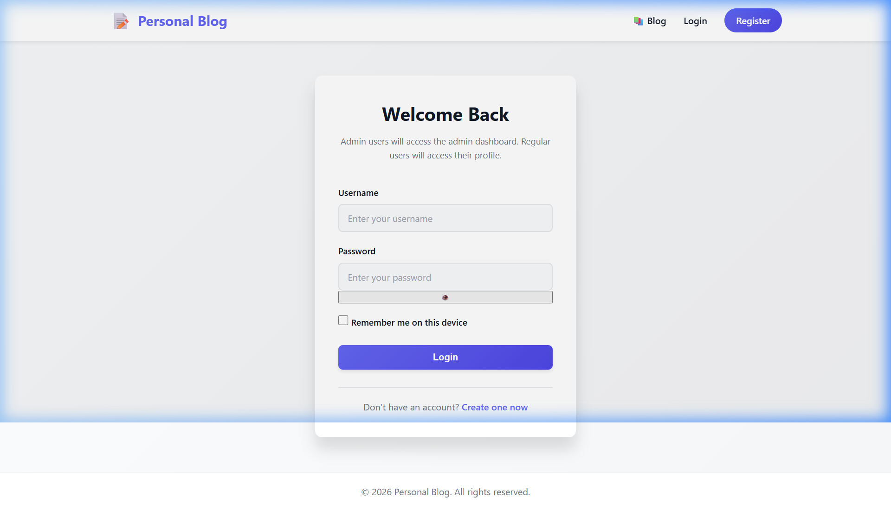
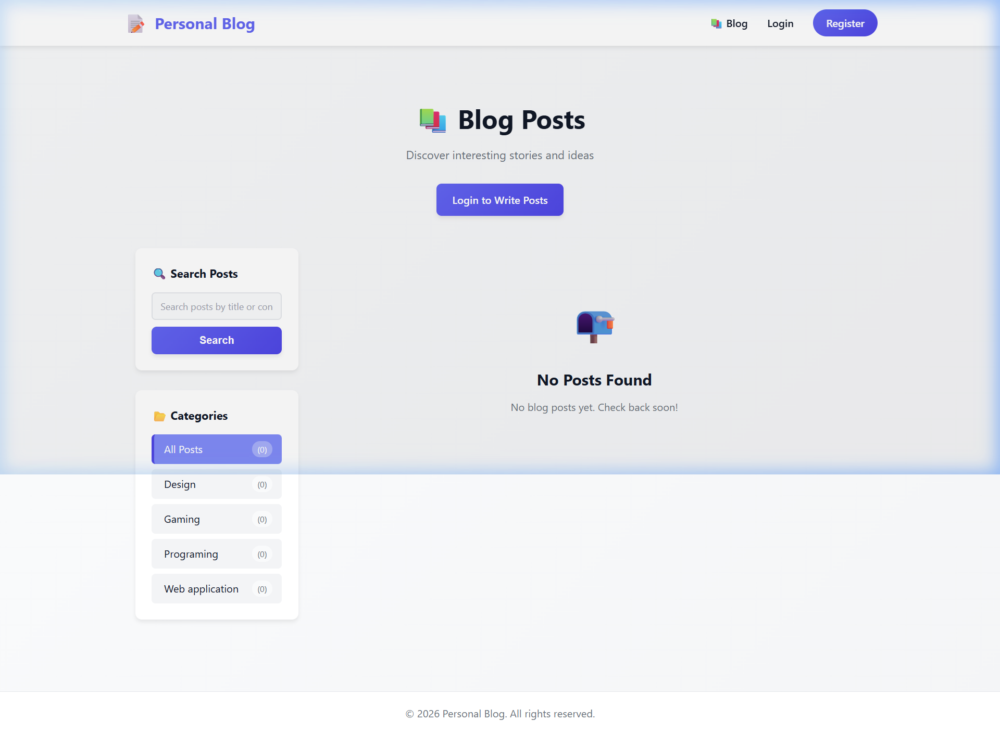
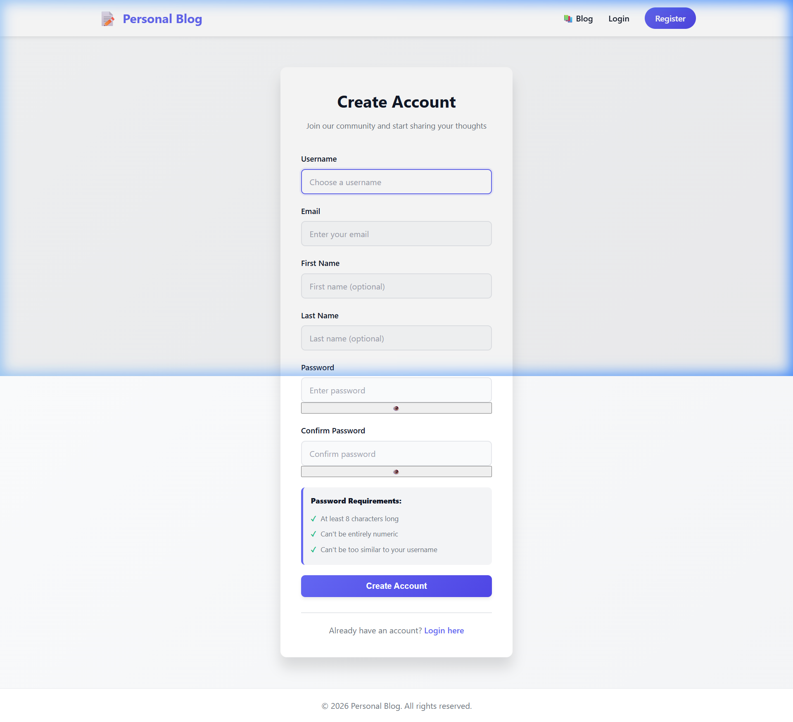

# 📝 Personal Blog

A full-featured **Personal Blog Management System** built with Django. Users can register, log in, write blog posts, browse posts by category, search, and manage their content — all with a clean and modern UI.

---

## 🖼️ Screenshots

| Login Page | Blog List |
|---|---|
|  |  |

| Register Page |
|---|
|  |

---

## ✨ Features

- 🔐 **User Authentication** — Register, Login, Logout, Password Change
- 📝 **Blog Posts** — Create, Read, Update, Delete posts with image uploads
- 🗂️ **Categories** — Organize posts by category
- 🔍 **Search** — Search posts by title or content
- 📄 **Pagination** — Browse posts across multiple pages
- 👤 **User Profile** — View and manage your own posts
- 🛡️ **Admin Dashboard** — Manage all users, posts, and categories
- 💬 **Comments** — Comment on blog posts
- 📱 **Responsive Design** — Works on all screen sizes

---

## 🛠️ Tech Stack

- **Backend:** Python 3.11, Django 4.2
- **Database:** SQLite3
- **Frontend:** HTML5, CSS3, JavaScript
- **Auth:** Django built-in authentication system
- **Media:** Pillow (for image uploads)

---

## 🚀 Getting Started

### Prerequisites

- Python 3.11+
- pip

### Installation

1. **Clone the repository**
   ```bash
   git clone https://github.com/YOUR_USERNAME/personal-blog.git
   cd personal-blog
   ```

2. **Create a virtual environment**
   ```bash
   python -m venv venv
   venv\Scripts\activate   # Windows
   # source venv/bin/activate  # Mac/Linux
   ```

3. **Install dependencies**
   ```bash
   pip install -r requirements.txt
   ```

4. **Apply migrations**
   ```bash
   python manage.py makemigrations
   python manage.py migrate
   ```

5. **Create a superuser (admin)**
   ```bash
   python manage.py createsuperuser
   ```

6. **Run the development server**
   ```bash
   python manage.py runserver
   ```

7. Open your browser and go to: [http://127.0.0.1:8000](http://127.0.0.1:8000)

---

## 📁 Project Structure

```
personal_blog2/
├── accounts/           # User authentication app
│   ├── templates/
│   ├── views.py
│   ├── forms.py
│   └── urls.py
├── blog/               # Blog management app
│   ├── templates/
│   ├── models.py
│   ├── views.py
│   ├── forms.py
│   └── urls.py
├── personal_blog2/     # Project settings
│   ├── settings.py
│   └── urls.py
├── static/             # Static files (CSS, JS)
├── media/              # User uploaded images
├── manage.py
└── requirements.txt
```

---

## 🔑 Admin Access

Visit [http://127.0.0.1:8000/admin/](http://127.0.0.1:8000/admin/) and log in with your superuser credentials.

---

## 📄 License

This project is open source and available under the [MIT License](LICENSE).

---

## 🙋 Author

Made with ❤️ using Django.
